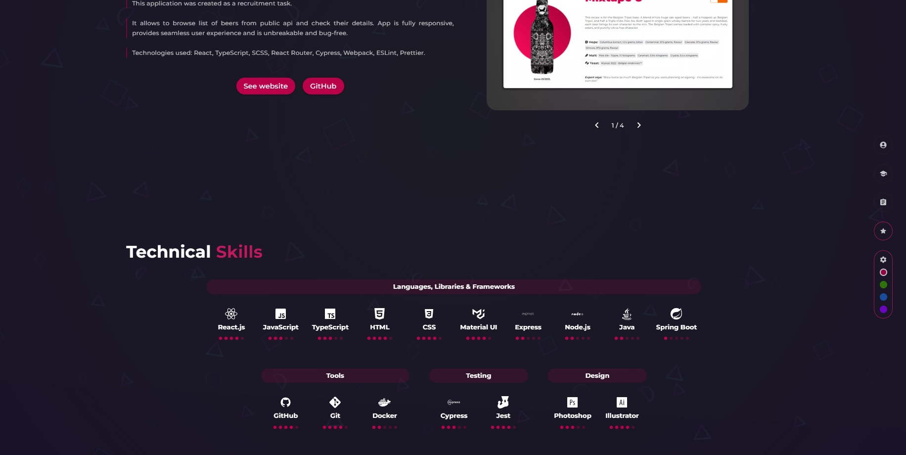

# HCywka Portfolio

Currently deployed at https://hcywka.netlify.app

## Description
My personal portfolio created in React + TypeScript with Mobile First approach in mind. Application is fully responsive, features are tested with unit and e2e tests. Portfolio includes following sections: 
- Contact,
- Experience,
- Education,
- Featured projects,
- Technical skills (and ones I will soon gain).

## Built with

## Installation
Just run `npm install` and then `npm run`. Your app should be available at `localhost:3000`.

## Other commands
`npm run cypress:component`- runs unit tests.

## Gallery

Contact and Experience sections

Projects section

Projects and Technical skills sections
